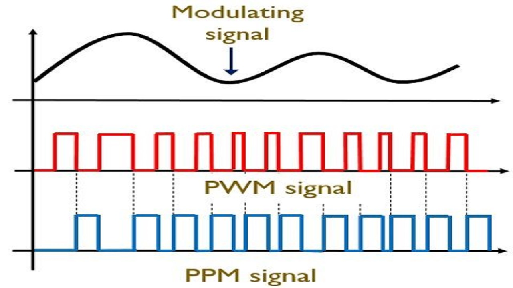

# Digital_Communication-Information_Theory_and_Coding

Resources for Digital Communication & Information Theory and Coding

- Notes
  - [Digital Communication - Tutorialspoint](https://www.tutorialspoint.com/digital_communication/index.htm)
  - [Shannon-Fano Algorithm](https://www.geeksforgeeks.org/shannon-fano-algorithm-for-data-compression/)
  - [Information Entropy](https://www.geeksforgeeks.org/information-entropy-using-matlab/)
  - [Arithmetic Encoding and Decoding](https://www.geeksforgeeks.org/arithmetic-encoding-and-decoding-using-matlab/)

- Courses on NPTEL
  - [Digital Communication by Prof. Bikash Kumar Dey - IIT Bombay](https://nptel.ac.in/courses/117/101/117101051/#)

- Courses on Freevideolectures
  - [Information Theory and Coding by Prof. S.N.Merchant - IIT Bombay](https://freevideolectures.com/course/3052/information-theory-and-coding)
  
- Books
  - Information Theory, Coding and Cryptography by Ranjan Bose
